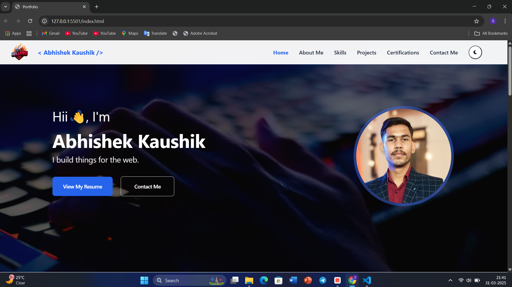

# Portfolio Website:
## 🚩Front page of website:

<br>
<br><br><h3>A modern, responsive portfolio website showcasing my skills, projects, and professional journey. Built with HTML, CSS, and JavaScript, featuring a clean design with dark/light theme support.<h3/>

## 🌟 Features:

- **Responsive Design**: Fully responsive layout that works on all devices
- **Dark/Light Theme**: Toggle between dark and light modes for comfortable viewing
- **Interactive UI**: Smooth scrolling and interactive elements for better user experience
- **Multiple Sections**: 
  - Home with personal introduction
  - About Me with education and experience
  - Skills showcase with visual indicators
  - Projects portfolio
  - Certifications display
  - Contact information

## 🛠️ Technologies Used:
[](https://developer.mozilla.org/en-US/docs/Web/HTML)
[](https://developer.mozilla.org/en-US/docs/Web/CSS)
[](https://developer.mozilla.org/en-US/docs/Web/JavaScript)

## 🚀 Getting Started:

1. Clone the repository:
   ```bash
   git clone https://github.com/Abhi999k/Personal_Portfolio.git
   ```

2. Open `index.html` in your browser to view the website

## 📂 Project Structure:

```
|── index.html          # Main HTML file
├── projects.html       # Projects page
├── certifications.html # Certifications page
├── css/                # stylesheet files
├── js/                 # JavaScript files
└── assets/             # Images and other assets
```

## 🎨 Features in Detail:

### Home Section:
- Professional introduction
- Quick access to resume and contact information
- Social media links

### About Section:
- Personal background and professional interests
- Educational timeline
- Professional experience highlights

### Skills Section:
- Technical skills visualization
- Categorized skill sets:
  - Full Stack Development
  - Cloud Security
  - IoT
  - Data Analysis

### Projects Section:
- Showcase of key projects
- Project descriptions and technologies used
- Links to live demos and source code

### Certifications Section:
- Display of professional certifications
- Organized presentation of achievements

## 📱 Contact me for support:
<div align="center">
  
<a href="https://www.linkedin.com/in/abhishek-kaushik-b677a2260/" target="_blank"></a>
<a href="https://www.x.com/Abhishek_9900" target="_blank"></a>
<a href="mailto:panditak095@gmail.com"></a>
<a href="https://www.facebook.com/Abhishek.Kaushik0" target="_blank"></a>
<a href="https://www.instagram.com/rangbaaz_abhishek__/" target="_blank"></a> 
<a href="https://wa.me/917017212992?text=Hello%2C%20I%20want%20to%20connect%20with%20you!" target="_blank"></a>
<br>
[](https://github.com/Abhi999k/portfolio)
[](https://github.com/Abhi999k/portfolio)

[](https://github.com/Abhi999k/portfolio)

<br>


  

[](LICENSE)
</div>


